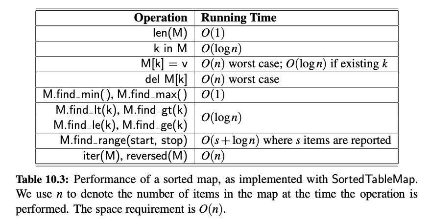

# Chapter 10: Maps, Hash Tables, and Skip Lists

---

# 10.1: Maps and Dictionaries

- Dict Class: Represents and abstraction known as a dictionary in which unique keys are mapped to associated values. Commonly referred to as Associative Arrays or Maps. 

    - Indexing to a Dict/Map: 
    ````
    currency = {}

    currency["Greece"] = "Drachma" # sets a new key, "Greece", within the currency dictionary and sets its value to "Drachma".
    ````

- Map ADT: Map Abstract Data Type are consistent with that of Python's built in `dict`class.
    - Map Behaviors:
        1. **Map[key]**  -> returns the value associated with the provided key-index if one exists; otherwise raises a KeyError. In Python this is implementefd with the special method `__getitem__` (defines indexing for objects).
        2. **Map[key] = value** -> Assign/associate value with the key in the map, replacing the exisitng value if the map already contains an element with said key. In Python, this is implemented with the special method `__setitem__`.
        3. **del Map[key]** -> Remove from the map the element with the provided key; if the map has no element raise KeyError. In Python, this is implemented with the special method `__delitem__`. 
        4. **len(Map)** -> Return the number of elements in the map. In Python, this is implemented with the special method `__len__`.
        5. **iter(Map)** -> The default iteration for a map generates a sequence of keys in the map. In Python, this is implemented with the special method `__iter__`, and it allows for loops in the form `for key in Map`.
        6. **k in M** -> Return True if the map contains an element with the provided key. In Python, this is implemented with the special `__contains__`method. 
        7. **Map.get(key, default=None)** -> Return Map[key] if the key exists in the map; otherwise return default value provided via parameter override. This provides a form to query Map[key] without risk of KeyError.
        8. **Map.setdefault(key, default)** -> If the key exists in the map, simply return the value at Map[key]; however if the key does not exist, set Map[key] = default and return that value. 
        9. **Map.pop(key, defualt=None)** -> Remove the element/record associated with the given key from the map and return is associated value. If the key is not in the map, return the default value (or raise KeyError if default=None)
        10. **Map.popitem()** -> Remove an arbitrary key-value pair from the map, and return a (key, value) tuple representing the removed pair. If the map is empty, raise KeyError. 
        11. **Map.clear()** -> Remnove all key-value pairs from the map.
        12. **Map.keys()** -> Return a set-like view of all the keys in the map.
        13. **Map.values()** -> Return a set-like view of all the values in the map. 
        14. **Map.items()** -> Return a set-like view of (key, value) tuples of all entries of the map. 
        15. **Map.update(Map2)** -> Assign Map[key] = value for every (key, value) pair in map Map2
        16. **Map == Map2** -> Return True if Map and Map2 have identical key-value associations. 
        17. **Map != Map2** -> Return True if Map and Map2 do not have identical key-value associations.

- Python's Collections Module contains the Mapping and MutableMapping classes.
    - Mapping Class: Includes all nonmutable methods supported by Python's dict class. 
    - MutableMapping Class: Extends the Mapping class to include mutable methods.

- Simple Unsorted Map Implementation: Inherits from the MapBase class where non-public _Item subclass contains (key, value) tuples. However this data structure stores the items in a unsorted list, for O(1) appends, but O(n) look-ups and deletions. 
    - Key Features:
	    - Inherits from MapBase: This provides a common structure for all map implementations.
	    - Stores items as _Item objects: _Item is a non-public subclass that holds (key, value) pairs.
	    - Uses an unsorted list: Items are appended to the end of the list.
	    - Efficiency:
	        - Insertion (O(1)): Appending a new key-value pair is fast.
	        - Search (O(n)): Since there is no ordering, finding a key requires scanning the list.
	        - Deletion (O(n)): Deleting a key requires searching for it first.

---

# 10.2: Hash Tables

- Hash Table: A data structure that maps keys to values using a hash function to compute an index, allowing for fast lookups, insertions, and deletions. It typically provides O(1) average time complexity for these operations.

- Hash Functions: Takes an input (key) and maps it to a specific index (or bucket) in a hash table. The goal is to distribute keys evenly across the available buckets to minimize collisions.
    - A collision in a hash table occurs when two different keys produce the same hash value and are mapped to the same index (or bucket). Since each index ideally holds only one value, collisions must be handled to maintain data integrity.
    - Example:
    
    - Steps of Hash Functions:
        1. Create Hash Code
            - Create a code or numeric representation based upon the given key of the provided item. Hash Codes do not have to be within the range of the Map length, but instead serve as a way to try and avoid collisions. Values could even be negative.
        2. 

- Polynomial Hash Codes: A hash code where a coefficient is applied to every value within some kind variable-length objects (strings, tuples, etc.) with increasing order of magnitude to increase the *spread* of the hash code for each positionin the object and avoid collisions.
    - Example:
    
    
    - Horner's Rule: an efficient method for evaluating polynomials, which reduces the number of multiplications required. Instead of computing each term separately, it rewrites the polynomial in a nested form.

- Cyclic-Shift Hash Codes: A variant of the polynomial hash code, but replaces the multiplication of some coefficient, a, with a cyclic shift of a partial sum by a certain number of bits.
    - In Python `<<`and `>>`bitwise operators can accomplish a Cyclic Shift, truncating results to 32-bit integers. 
    - Example: 5-bit Cyclic Shift
    
    - The leftmost 5 bits are place on the rightmost side, thus a 5-bit Cyclic Shift.
    


- Compression Functions: The second step in creating a hash table. It ensures that the arbitrary hash values (which could be large or spread out) are mapped into a fixed range that fits within the available buckets of our hash table.
    - Returns a value corresponding to a bucket to index the element into our hash table in the range of 0 to N -1.
    - Examples:
        1. The Division Method: Using the `mod`or `%` operator to find the remainder of `hash_code % N` 
            - If N is a nonprime value (e.g., 100), this creates an increased chance for collisions as more values are factors of N. 
            - If N is a prime value (e.g., 101), this reduces the chance of collisions to almost 0 or even 0 in some cases.
        2. The MAD Method: Multiply-Add-and-Divide method mimics a *random* bucketization using `[(a*hash_code + b) % p] % N`. Has a probability of key collisions of 1 / N.
            - p -> prime number > N
            - a -> random integer between [0, p - 1] & a > 0
            - b -> random integer between [0, p - 1] 

- Collisions: A collision takes place when two different keys map to the same bucket or index of a Hash Array.
    - Separate Chaining: If a collision occurs, colliding elements can be chained together to create a sub-structure within the bucket via a linked list (most common) or array for example.
        - Example:
        
    - Load Factor: The ratio of elements (n) per bucket (N), `λ = n / N`.
        - `λ` < 1 is preferred because this indicates that there are on average more buckets per element, thus allowing for quick access/look-up due to less collisions. 
        - `λ` > 1 indicates that there are fewer buckets per element on average. Where each bucket contains more than 1 element on average, reducing our access/look-up. 
    - Good hash functions, core operations run in O(⌈n/N⌉) for separate chaining. If `λ` is low (< 1) the operations stay close to O(1).


- Open Addressing: A way to handle collisions in a hash table, where instead of storing multiple values in the same bucket (chaining), values instead find an empty bucket if the initial one is already occupied. 
    1. Linear Probing: If trying to insert an item (k, v) with a hash code of j, where `j = h(k)`, and that bucket is already occupied, then we try to insert the item at `A[(j + 1) % N]`. If that is also occupied, continue increasing the numerical addition for each attempt. 
        - Cons: 
            1. Contiguous Clustering: Since linear probing searches sequentially through adjacent buckets, items tend to form clusters, increasing the likelihood of collisions and slows down alogs.  
    2. Quadratic Probing: If trying to insert an item(k, v) with a hash code of j, where `j = h(k)`, and that bucket is already occupied, then we try to insert the item at `A[(j + 1^2) % N]`. If that bucket is already occupied, continue increasing the numerical addition, being squared, for each probe attempt.
        - If `N` (number of buckets in the hashmap) is prime, and the maps is less than half full, you are guaranteed to find an empty slot.
        - Cons:
            1. Secondary Clustering: Keys that share a similar quadratic pattern will bunch up.
    3. Double Hashing: Instead of just adding +1 or +i², you introduce a secondary hash function `h′(k)` to mix things up and avoid clustering:
	    - First hash gives you: `h(k)`
	    - If `h(k)` is occupied, try: `A[(h(k) + i * h′(k)) mod N]` where:
            - `i` = number of attempts.
            - `h′(k)` = secondary hash function.
            - `h′(k)` needs to be non-zero (so you don’t get stuck retrying the same spot).
        - Common `h′(k)` Function: `h′(k) = q - (k mod q)`
            - `q` = some prime number < N (number of buckets in the array).
            - Makes sure that `h′(k)` is **not zero** and provides a good spread of values.
            - Prime numbers reduce the changes of repeating patterns, helping avoid clustering.  
        

- Load Factor in Separate Chaining vs. Open Addressing
    - With separate chaining, as the load factor approaches 1, the probability of a collision greatly increases. As a result, we revert the linear-based time methods to "chain" the collisions together within the bucket. 
    - With Open Addressing, as the load factor grows beyond 0.5 and approaches 1, clusters start to grow. 
        - Recommended to maintain a load factor < 0.5.

- Rehashing: When a load factor grows beyond the desired threshold, a *rehashing* should take place. 
    - Double the size of the current hashmap.
    - Create a new compression function to account for new increase `N`, number of buckets.
    - Using the previous element hashcodes, rehash the elements into the new hashmap. 

- Efficiency of Hash Tables:


# 10.3 Sorted Maps

- Exact Search: Looking up a specific key to retrieve its corresponding value. The key is hashed using a hash function, which maps it to an index in the table, allowing for O(1) average time complexity for retrieval. 

- Sorted Map ADT:
    - Methods:
        1. Map.find_min(): Return the (key,value) pair with minimum key (or None, if map is empty).
        2. Map.find_max(): Return the (key,value) pair with maximum key (or None, if map is empty).
        3. Map.find_lt(k): Return the (key, value) pair with the greatest key that is strictly less than k (or None, if no such item exists).
        4. Map.find_le(k): Return the (key, value) pair with the greatest key that is  less than or equal to k (or None, if no such item exists).
        5. Map.find_gt(k): Return the (key, value) pair with the least key that is strictly greater than k (or None, if no such item exists).
        6. Map.find_ge(k): Return the (key, value) pair with the least key taht is greater than or equal to k (or None, if no such item exists).
        7. Map.find_range(start, stop): Iterate all (key, value) pairs with start <= key < stop. If start is None, iteration begins with minimum key; if stop is None, iteration concludes with maximum key.
        8. iter(Map): Iterate all keys of the map according to their natural order, from smallest to largest. 
        9. reversed(Map): Iterate all keys of the map in reverse order; in Python this is implemented with the `__reversed__` method. 

- Sorted tables are primarily used in situations where we expect many searches but relatively few updates.

