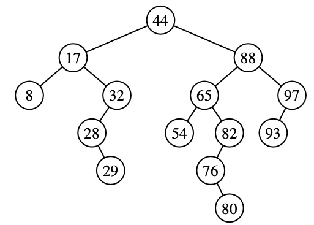

# Chapter 11 - Search Trees

## 11.1 - Binary Search Trees

- Binary Search Tree: A binary tree *T* with each position *p* storing a key-value (k,v) such that:
    - Keys stored in the left subtree of *p* are less than *k*.
    - Keys stored in the right subtree of *p* are greater than *k*.
    - Example:

    

    

## 11.2 - Balanced Search Trees