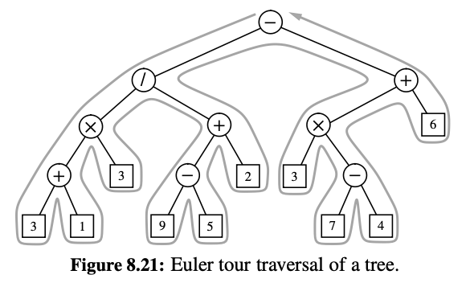

# Chapter 8: Trees

---

## 8.1: General Trees

- Trees: A tree is a way to organize data in a structure with nodes connected by lines, called edges. It starts from one main point, called the root, and branches out to other points (nodes). Each node can have more nodes connected to it. Trees are used to represent things that have a starting point and branches, like a family tree or folder system. 

- Tree Formal Def:  a tree T as a set of nodes storing elements such that the nodes have a parent-child relationship that satisfies the following properties:
    - If T is nonempty, it has a special node, called the root of T , that has no parent.
    - Each node v of T different from the root has a unique parent node w; every node with parent w is a child of w. Note that according to our definition, a tree.

- Siblings: Two nodes that are children of the same parent.
- External: A node that has no children aka *"leaves"*.
- Internal: A node that has 1 or more children.
- Ancestor/Descendant: node u is an ancestor of a node v if u = v or u is an *ancestor* of the parent of v. Conversely, we say that a node v is a *descendant* of a node u if u is an ancestor of v.
    - A node can be an ancestor of itself given this definition. 
- Edges: The "connection" or "pointer" between a parent node and it's child or vice versa.
- Path: A sequence of nodes that any two consecutive nodes in the sequence form an edge.   

- Ordered Trees: A tree is *ordered* if there is a meaningful linear order among the children of each node; first child, second child, etc. Visualized in left to right order. 
    - Example: A book would be the root, it's Preface is the first child, Chapter 1 is the second child, and so-on. 
 

- Position: A location within the Tree ADT, where elements are held.

- Tree ADT support the following methods:
    - For position, p:
    1. p.element(): Return the element stored at position p.
    - For Tree, T:
    1. T.root(): Return the position of the root of the tree T, or None if T is empty. 
    2. T.is_root(p): Return True if position p is the root of Tree T.
    3. T.parent(p): Returns the parent position of postition, p, or None if p is the root of T. 
    4. T.num_children(p): Return the number of children of position p.
    5. T.children(p): Generate an iteration of the children of position p.
    6. T.is_leaf(p): Return True if position p does not have any children.
    7. len(T): Return the number of positions (and hence elements) that are contained in the tree T. 
    8. T.is_empty(): Return True if tree T does not contain any positions. 
    9. T.positions(): Generate an iteration of all positions of tree T. 
    10. iter(T): Generate an iteration of all elements stored within tree T. 


- Tree's have:
    1. Depth: The number of ancestors of a given position, excluding p itself. 
        - The root position has a depth, d = 0.
        - Tip: Count edges "upwards" until you reach the root, the number of edges is the depth.
    2. Height: The longest path (number of edges) from a "root" position to it's furthest leaf.
        - Tip: Count edeges "downward" from a given position, finding the longest route to a childless position. 

---

## 8.2: Binary Trees

- Binary Tree: An ordered tree with the following properties:
    1. Every node has at most 2 children.
    2. Each child node is labeled as being either a left child or a right child.
    3. A left child precedes a right child in the order of children of a node. 

- "Proper" or "Full" Binary Tree: A Binary Tree where every node has either 0 or 2 children. 
    - Internal nodes have 2 children.
    - External nodes are leaves, and have 0 children.

- Binary Tree ADT has the following methods:
    1. T.left(p): Return the position that represents the left child of p, or None if p has no left child. 
    2. T.right(p): Return the position that represents the right child of p, or None if p has no right child. 
    3. T.sibling(p): Return the position that represents the sibling of p, or None if p has no sibling. 
    
---

## 8.3: Implementing Binary Trees

- For *Linked Binary Trees* a reasonable set of update methods to support for general usage are the following:
    1. T.add_root(e): Create a root for an empty tree, storing e as the element, and return the position of that root; an error occurs if the tree is not empty.
    2. T.add_left(p, e): Create a new node storing element e, link the node as the left child of position p, and return the resulting position; an eorror occurs if p already has a left child. 
    3. T.add_right(p, e): Create a new node storing element e, link the node as the right child of position p, and return the resulting position; an eorror occurs if p already has a right child. 
    4. T.replace(p, e): Replace the element stored at position p with element e, and return the previously stored element.
    5. T.delete(p): Remove the node at position p, replacing it with its child if anym and return the element that had been stored at p; an error occurs if p has two children. 
    6. T.attach(p, T1, T2): Attach the internanal structure of trees T1 and T2, respectively, as the left and right subtrees of leaf position p of T, and reset T1 and T2 to empty trees; an error condition occurs if p is not a leaf. 

---

## 8.4: Tree Traversal Algorithms

- Traversal of a Tree: A systematic way of accessing, or "visiting," all the positions of T. 

    1. Preorder Traversal: The root of the Tree is visited first and then the subtrees rooted at its children are traversed recursively.
        - If the Tree is ordered, then the subtrees are traversed according to the order of the children.
        - Runningtime: O(n) 
        - Example: 
            ```
                  A
                 / \
                B   C
               / \    \
              D   E    F
            ```
            - Order of Traversal using Preorder Traversal:
                A -> B -> D -> E -> C -> F
    
    2. Postorder Traversal: Recursively traverses the subtress rooted at the children of the root first, and then visits the root.
        - Runningtime: O(n)
        - Example: 
            ```
                  A
                 / \
                B   C
               / \    \
              D   E    F
            ```
            - Order of Traversal using Postorder Traversal:
                A -> B -> D -> E -> F -> C 
    
    3. Breadth-First Tree Traversal: To traverse a tree so that all positions at depth d are visited before visiting positions at depth d+1. 
        - The process is NOT recursive, since we are not traversing entire subtrees at once.
        - A queue ADT can be used to produce a FIFO semantics for the order in which we visit nodes.
        - Runningtime: O(n), due to the *n* calls to enqueue and *n* calls to dequeue
        - Example: 
            ```
                  A
                 / \
                B   C
               / \    \
              D   E    F
            ```
            - Order of Traversal using BFT Traversal:
                A -> B -> C -> D -> E -> F 

    4. Inorder Traversal: Specific to a Binary Tree, and visits nodes in the order: left subtree -> root -> right subtree.
        - Runningtime: O(n)
        - Example: 
            ```
                  A
                 / \
                B   C
               / \    \
              D   E    F
            ```
            - Order of Traversal using Inorder Traversal:
                D -> B -> E -> A -> C -> F
        - Binary Search Tree: Storing and ordered sequence of elements in a binary tree.

- Parenthetic String Representation: A textual representation of the structure of a tree using parentheses. It shows the relationships between nodes, where each node's children are enclosed in parentheses immediately following the node's label.
    - Example:
        ```
        A
        ├── B
        │   ├── E
        │   └── F
        └── C
            └── G
        ```
        - Parenthetic String Representation: A(B(E,F),C(G))

- Euler Tour Traversal: A traversal for a general tree that can be informally defined as a "walk" around the tree. 
    - Starting from the root, the edges from node to node always reside on the *left* during our walk. 
    - A "pre-visit" occurs when first reaching the position, that is, when the walk passes immediately left of the node in the Example below.
    - A "post-visting" occurs when the walk later proceeds upwards from that position, that is, when the walk passes to the right of the ndoe in the Example below. 
    - Example:
    
    

- Template Method Pattern: An OOP design pattern that provides a generic algorithm in a **base class**, while allowing subclasses to customize specific steps of the algorithm. Similar to an Abstract Base Class (ABC).
    - Hooks: Customizable methods or "placeholders" in the base class. Hooks are called at specific points in the algorithm and can be customized.

---

## 8.5: Case Study: An Expression Tree

