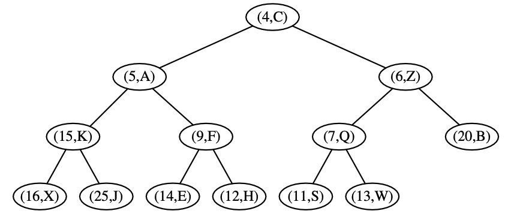
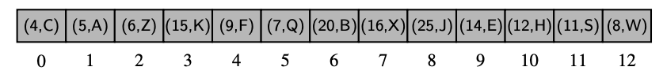

# Chapter 9: Priority Queues

---

# 9.1: The Priority Queue Abstract Data Type

- Priority Queue: A data structure where each element has a priority, and element with higher priority are served before elements with lower priority. If 2 elements have the same priority, they are typically dequeued in the order they were added. 

    - In Python a Priority Queue ADT supports the following methods:
        1. P.add(k, v): Insert an item with key k and value v into priority queue P. 
        2. P.min(): Return a tuple (k, v) representing the key and value of an item in priority queue P w/ minimum key. (element is NOT dequeued). An error occurs if the PQ is empty. 
        3. P.remove_min(): Remove an item with minimum key from PQ P, and return a tuple (k, v) representing the key and value of the removed item; an error occurs if the PQ is empty.
        4. P.is_empty(): Return True if PQ P does not contain any items. 
        5. len(P): Return the number of items in the PQ P.

---

# 9.2: Implementing a Priority Queue

- Priority Queue Base class:

- Priority Unsorted Queue class:

- Priority Sorted Queue class: 

---

# 9.3: Heaps

- Heap Data Structure: A Binary Tree that stores a collection of items at its positions and that satisfies two additional properties:
    1. A relational property defined in terms of the way keys are sorted in T.
        - Heap-Order Property: For every position in the Binary Tree, other than the root, the key stored at that position has a value that is greater than or equal to the parent of the said position. 
            - The root is the *smallest* key value, with the highest priority. 
    2. A structural property defined in terms of the shape of T itself.
        - Complete Binary Tree Property: All levels, except possibly the last, are completely filled with nodes. In the last level, or the height of the tree, all nodes are as far left as possible. 

- Adding Item to Heap: A new node with key/value pair will be created and either inserted at the rightmost position on the furthest depth, or if the lowest depth is full, insert at the leftmost position on depth + 1, a new lower level. 
    - This satisfies the BT structure but we must evaulate the key of the newly inserted node with the key of it's parent. If the key of the newly inserted node is less than the key of the parent, swap nodes, aka *up-heap bubbling*.

- Removing Item w/ Minimum Key:
    - When you remove the minimum (remove_min) in a min-heap, you remove the root node because it has the smallest key.
    - The last node (rightmost node at the lowest level) replaces the root to maintain the complete binary tree structure.
    - Then, you perform down-heap bubbling (also called heapify down or sift down) to restore the heap-order property. During this process, the node swaps with its smallest child (left or right) until it is smaller than both.

- Array-Based Representation 
    - If p is the root of T , then f (p) = 0.
    - If p is the left child of position q, then f (p) = 2 f (q) + 1.
    - If p is the right child of position q, then f (p) = 2 f (q) + 2.

    - Tip: Read the tree top-down, when reaching a new depth read left to right. 

    - Example:
    
    

